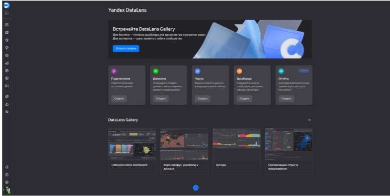
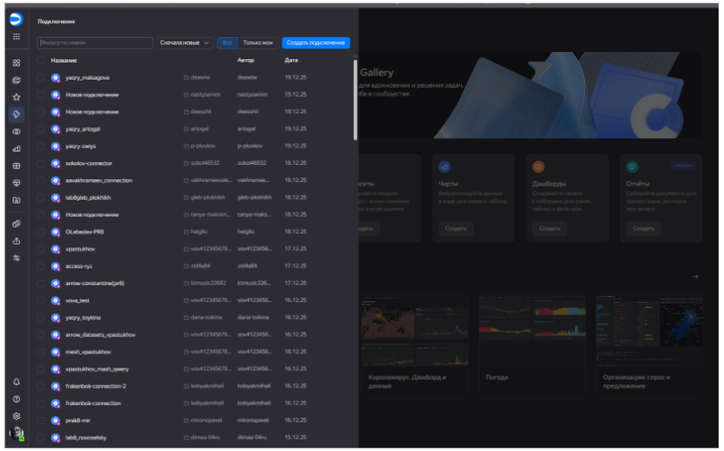
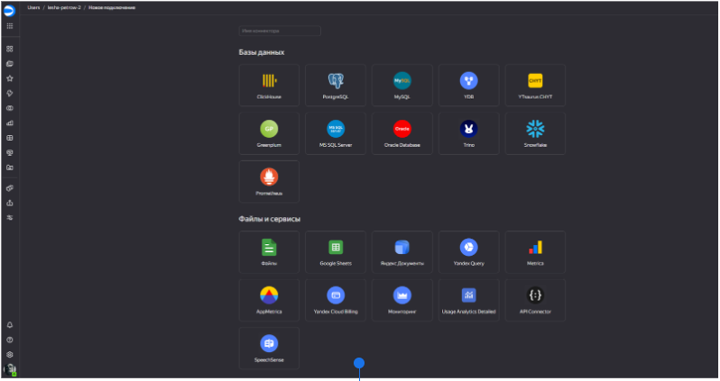
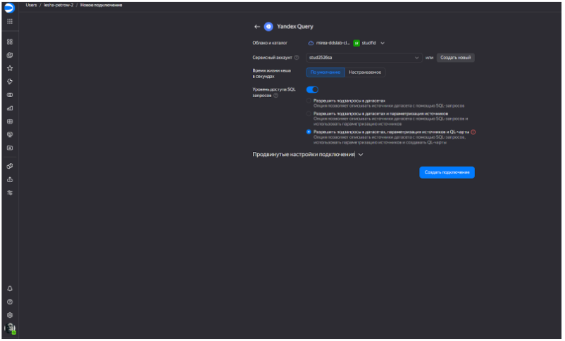
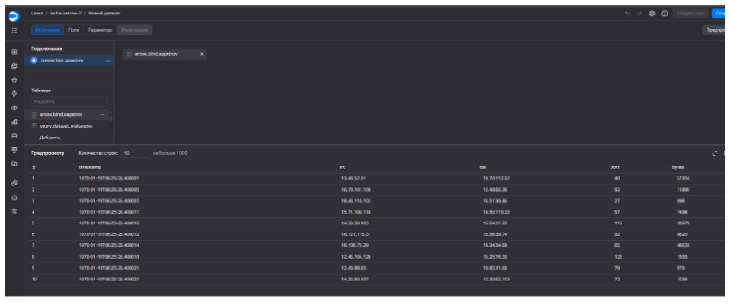
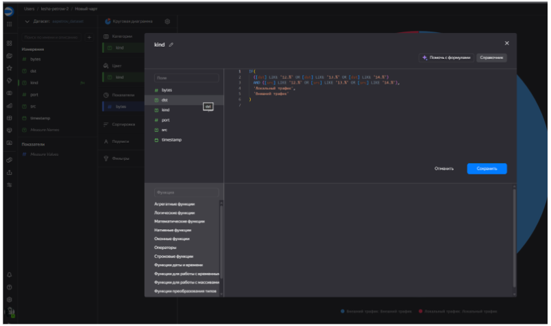
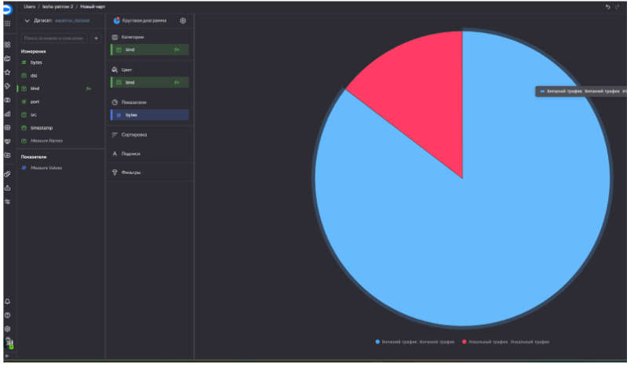
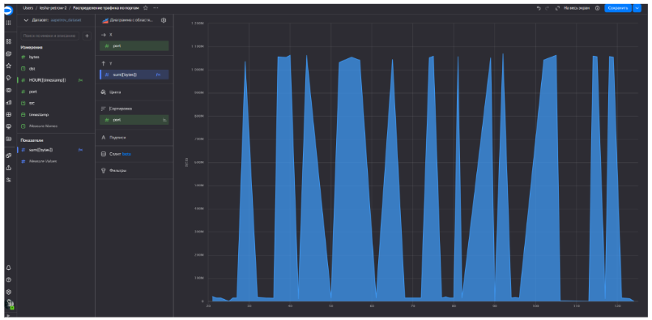
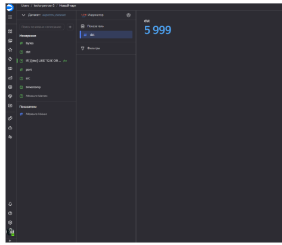
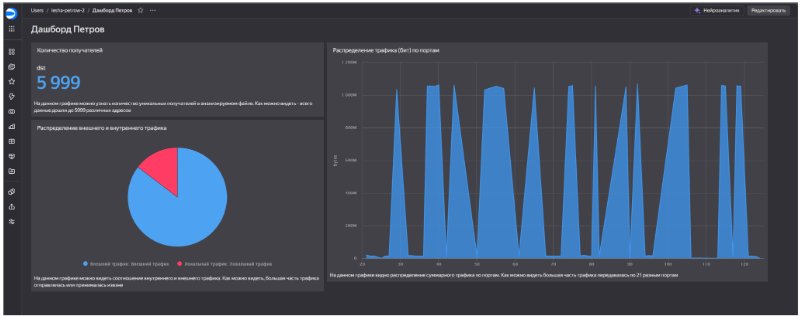

## Цель работы

1.  Изучить возможности технологии Yandex DataLens для визуального анализа структурированных наборов данных
2.  Получить навыки визуализации данных для последующего анализа с помощью сервисов Yandex Cloud
3.  Получить навыки создания решений мониторинга/SIEM на базе облачных продуктов и открытых программных решений
4.  Закрепить практические навыки использования SQL для анализа данных сетевой активности в сегментированной корпоративной сети

## Исходные данные

1.  Сервис Yandex DataLens
2.  Файл для анализа в Object Storage
3.  Облачное решение для анализа данных Yandex Query

## План:

1.  Подключиться к Yandex Query из Yandex DataLens
2.  Создать необходимые графики и диаграммы
3.  Создать дашборд
4.  Составить отчет и выложить его и исходный qmd/rmd файл в свой репозиторий

## Шаги

1\. Настроить подключение к Yandex Query из DataLens

Откроем DataLens

Просмотр всех имеющихся подключений:

2\. Начальный экран для выбора источника

3\. Создать из запроса YandexQuery датасет DataLens

Создадим новое подключение к Yandex Query

Добавим новый датасет

4\. Создать чарты из датасета

Новое окно визуализации

Содержмое поля kind, который необходим для создания диаграммы:

Круговая диаграмма соотношения внешнего и внутреннего сетевого трафика:

График распределения трафика по портам

Чарт(график) с количеством получателей

5\. Создать дашборд

 [Ссылка на итоговый
дашборд](https://datalens.yandex/5pnft63nn9dip)

## Вывод
При выполнении работы были изучены технологии Yandex DataLens для визуального анализа структурированных наборов данных, получены навыки визуализации данных с помощью сервисов Yandex Cloud и закреплены практические навыки использования SQL для анализа данных сетевой активности в сегментированной корпоративной сети
